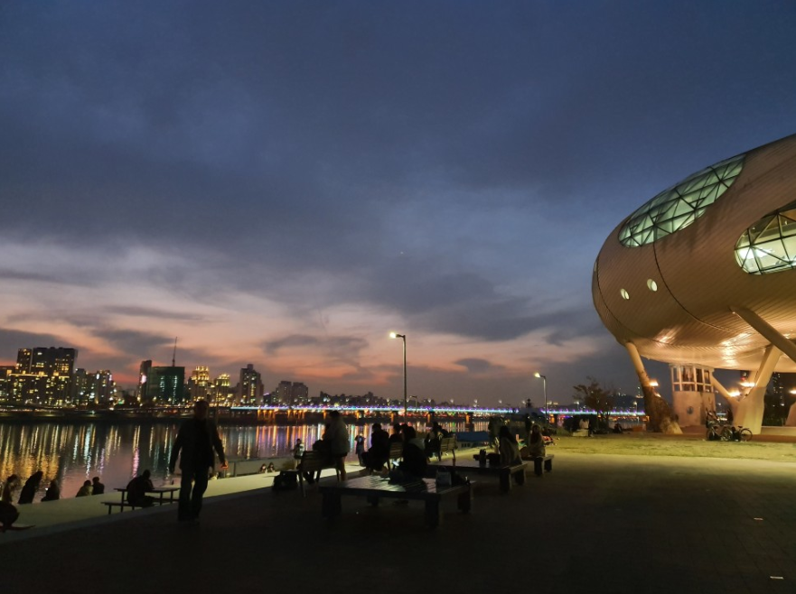
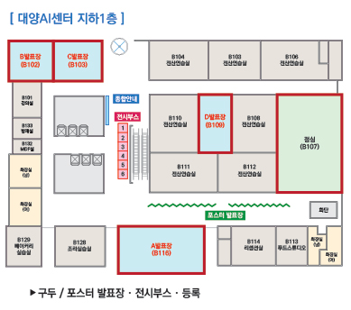
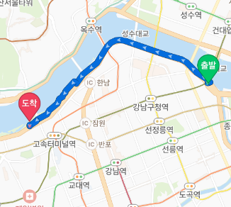
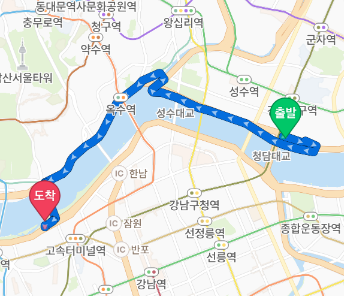

# self-driving-PM

Could Personal Mobility Drive Automatically?  
과연 소형/퍼스널 모빌리티가 스스로 달릴 수 있을까요?  

 

### 2021년 deer-corporation 에서 이 프로젝트를 진행하고 있습니다.

deer homepage : https://deering.co/#/
deer self-driving recriutment : https://www.notion.so/Deer-coporation-ba92fb4da87748878dc4da68bf6a9f44

 

## File Structure

### LAB

- 공부중

### RELEASE

- 사용 가능한 버전 (2022년 출시 목표)

### README-IMG

- README.md 에 사용된 이미지

 

## Goal

  
https://blog.naver.com/ipting/221755870948

 

  
https://blog.naver.com/verena_/221660048293

 

### Trial1 : 실내무인주행 (난이도 중)

 

 

- Goal : 스스로 엘리베이터에 탑승할 수 있는 수준의 주행로봇을 제작.

 

### Trial2 - Course1 : 청담 > 반포 (난이도 중상)

- Goal : 자전거도로를 따라 청담에서 반포까지 갈 수 있는 모빌리티를 제작.

 

### Trial2 - Course2 : 뚝섬 > 반포 (난이도 상)

 

- Goal : 자전거도로를 따라 뚝섬에서 반포까지 갈 수 있는 모빌리티를 제작.

 

## To Achieve

 
