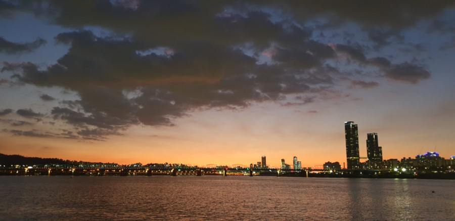

# self-driving-PM
Could Personal Mobility Drive Automatically?

 

## Goal

  
https://blog.naver.com/ipting/221755870948

 

  
https://blog.naver.com/verena_/221660048293

 

### Course 1 : 뚝섬 > 반포 (난이도 중상)

 

- 경로에 다리(bridge) 와 급격한 커브가 서 큰 환경 변화를 감당해야 한다.

 

### Course 2 : 청담 > 반포 (난이도 중하)

 

## To Achieve

 
